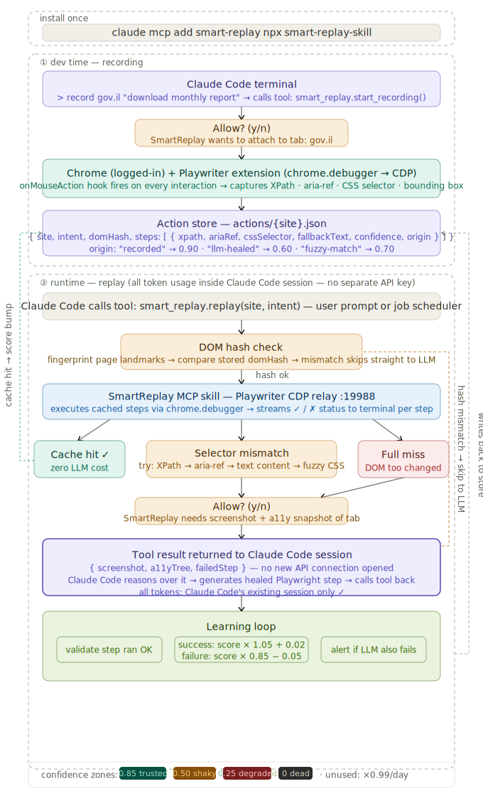

# Smart Replay — High Level Design



<!-- smart_replay_hld.svg is the canonical, hand-maintained diagram for this doc.
     Edit the SVG markup directly when the design changes — keep it in step with the
     prose below (see the collector-design-sync skill). There is no generated source. -->

> **Status:** v1 design — "Dumb Replay with LLM Heal." Numeric confidence scoring,
> DOM hash gate, multi-tier selector fallback, and the learning-loop math from
> earlier revisions are deferred to v2 (see [`../backlog.md`](../backlog.md)). When
> implementing v1, treat anything not described here as out of scope.

> **Diagram TODO:** the SVG above predates the v1 pivot (codegen + TS flow modules
> + code-patch heal-back). It still shows the JSON action store and the four-tier
> selector hierarchy. Update the SVG markup to match the prose below, or replace
> it with a fresh diagram, before relying on the picture for any external audience.

## What this is

A Claude Code skill that extracts documents from many logged-in websites by
running per-site Playwright flow modules. Fast and cheap on the happy path
(zero LLM tokens), with automatic LLM fallback when a site's DOM changes.
Every LLM fallback patches the flow module as a git-diffable code change,
so each site's resilience improves over time without a separate cache or
numeric-scoring layer.

---

## Install

```bash
claude mcp add smart-replay npx smart-replay-skill
```

First run prompts the user for two one-time setup steps:

1. **Install the Playwriter Chrome extension** from the Chrome Web Store:
   <https://chromewebstore.google.com/detail/playwriter-mcp/jfeammnjpkecdekppnclgkkffahnhfhe>
2. **Click the extension icon on the target tab.** The icon turns green when
   Playwriter is attached to that tab.

The skill **auto-spawns the Playwriter relay** (`npx playwriter serve --host
127.0.0.1`) as a subprocess on the first MCP tool call and shuts it down on
disconnect — the user never runs it manually.

No credentials to configure. Token usage flows through Claude Code's existing
session — no separate `ANTHROPIC_API_KEY` needed.

---

## Requirements

What the skill must do:

- **Runs inside the user's regular browser** — their session and cookies, so login is something they already did.
- **Navigates websites to fetch the relevant tax-return documents.**
- **Cheap, reliable, and fast.**
- **Runs through the user's local Claude Code** — shipped as a plugin/skill. (Also a GTM angle.)
- **Privacy:** username and password never leave the user's computer.
- **Terminal UX (inside the user's Claude Code):** live per-step status — concise, one line per action, an explicit note when LLM fallback kicks in, and a gate prompt for big decisions (e.g. `Can I start running? (y/n)`).

### To achieve that

| Requirement | Approach |
|---|---|
| Run in a logged-in browser | The **Playwriter Chrome extension** attaches to the user's tab via `chrome.debugger`. The `--remote-debugging-port` flag does not work — silently ignored since Chrome 136. |
| Not be detected as a bot | Drive input over **CDP** (`Input.dispatchMouseEvent`) so events are `isTrusted: true` — see [`playwriter_internals.md`](./playwriter_internals.md). |
| Fast and cheap | **Per-site flow modules** authored once via `playwright codegen`, then replayed with no LLM on the happy path. See [ADR-003](../decisions/ADR-003-recording-via-playwright-codegen.md) + [ADR-004](../decisions/ADR-004-ts-flow-modules.md). |
| When replay fails | **Fall back to the LLM** to patch the broken step in the flow module, then re-replay. The patch is a git-diffable code change. |
| Which tokens to use | The **user's local Claude Code** session — no separate API key, usage is visible in their context window. |
| Privacy | The user logs in themselves; the skill only attaches to a tab they approve. Credentials are never typed, proxied, or stored, and the CDP relay binds to localhost only. |

---

## Phase 1 — Recording (developer-only, dev time)

There is no runtime recorder. New site flows are authored by a developer
using `playwright codegen` and committed to this repo as TypeScript modules.

### The recording ritual

For each new site:

1. **Run codegen on a fresh browser:**
   ```bash
   npx playwright codegen https://<site>
   ```
2. **Log in inside codegen.** This isn't the user's real session — it's a sacrificial Chromium so cookies don't pollute anything important. Use a throwaway login if the site permits.
3. **Walk the flow** you want to record (e.g., navigate to the report, expand the year, click download).
4. **Sanitize the generated code:**
   - Strip login steps — at runtime the user performs login themselves ([repo ADR-009](../../docs/decisions/ADR-009-user-owns-login-and-captcha.md)).
   - Strip any captured credentials (see [`feedback_codegen_credentials`](../../.claude/projects/-Users-shargil-Documents--------------2026-05-14----------RobinTax/memory/feedback_codegen_credentials.md)).
   - Replace codegen's brittle `nth-child` / class selectors with `get_by_role` / `get_by_text` — these survive the most common DOM changes for free.
   - Replace `waitForTimeout` sleeps with content waits (`waitFor`, `expect_response`).
5. **Wrap each action in `step("name", fn)`** so failures know which step broke.
6. **Save as `Collector/skill/src/flows/{site}.ts`** and commit.

This is the same checklist the research scaffold followed at
`research/flows/ita.py:8-13`, ported to v1.

### Flow module format

```ts
// Collector/skill/src/flows/ita.gov.il.ts
import type { Page } from "playwright-core";
import type { FlowDeps } from "../types";

export const domain = "ita.gov.il";
export const intent = "form 106";

export async function run(page: Page, deps: FlowDeps): Promise<void> {
  const { step, explain, confirm, outDir } = deps;

  await step("open personal area", () =>
    page.goto("https://secapp.taxes.gov.il/sr-ezor-ishi/main/main-page"),
  );

  await step("wait for post-login signal", () =>
    page
      .getByRole("link", { name: "ניווט למערכת טפסי 106" })
      .waitFor({ timeout: 5 * 60_000 }),
  );

  // ... see research/flows/ita.py for the full flow we're porting.
}
```

Each `step(name, fn)` wraps the action so that when `fn` throws, the replay
engine knows the step's name + source location and can package a heal
payload pointing at the right place in the file.

---

## Phase 2 — Replay (runtime)

Triggered by a user prompt, job scheduler, or Claude Code tool call.

### Replay engine

The MCP skill is a long-lived process. On `replay(site, intent)`:

1. Auto-spawns the Playwriter relay if not already running.
2. Connects via `chromium.connectOverCDP("ws://127.0.0.1:19988")`.
3. Verifies a target tab is attached (extension icon green); prompts the user if not.
4. Imports `flows/{site}.ts` and runs `flow.run(page, deps)`.
5. Streams per-step status to the terminal:

```
✓ step 1/4  open personal area
✓ step 2/4  wait for post-login signal
✗ step 3/4  expand year 2025  → locator threw
```

### Session lifecycle (heal round-trip)

The MCP process holds a session map across the heal round-trip:

- `replay(site, intent)` → returns `{ status: "ok" }` on full success, or `{ status: "needs_heal", sessionId, stepName, snapshot, a11yTree, sourceLocation }` when a step throws.
- `continue(sessionId)` → re-imports the (now-patched) flow module and resumes from the failed step on the same live `page`.
- `abort(sessionId)` → closes the page and drops the session.
- Sessions auto-expire after 10 min idle.
- Only one concurrent session per site (prevents racing pages on the same tab).

### LLM heal-back

When a step throws:

1. The skill captures `page.screenshot()` + `getAriaSnapshot()` (Playwriter's exported a11y helper).
2. Returns `{ sessionId, stepName, snapshot, a11yTree, sourceLocation }` as a tool result to Claude Code's existing session — no new API call, per [`project_dev_direct_anthropic`](../../.claude/projects/-Users-shargil-Documents--------------2026-05-14----------RobinTax/memory/project_dev_direct_anthropic.md).
3. Claude Code reads the snapshot and the flow file, then **patches the broken step via the Edit tool**. The patch is a git-diffable code change — reviewable, revertable, blameable.
4. Claude Code calls `continue(sessionId)`. The skill re-imports the flow module and resumes from the failed step on the same live `page`.

```
SmartReplay needs screenshot + a11y snapshot of tab  Allow? (y/n): y
Claude Code: get_by_role("button", name=/^להצגת טופס 106/) no longer matches.
            Editing flows/ita.gov.il.ts step "expand year 2025" to use the new ARIA label.
✓ step 3/4  expand year 2025 (healed)
✓ step 4/4  download 106
```

There is no separate JSON cache to write back to. **The flow file IS the cache.**

---

## Deferred to v2 — see `backlog.md`

The following pieces from the original HLD are deferred until we have
repeat-failure telemetry from real users:

- **DOM hash gate** — fingerprint before replay.
- **Numeric confidence scoring + decay** — `× 1.05 + 0.02`, `× 0.85 − 0.05`, `× 0.99/day`. Formulas live in [`confidence_scoring.md`](./confidence_scoring.md) (still the v2 target).
- **Multi-tier selector fallback** — XPath → aria-ref → text → fuzzy CSS hierarchy. v1 uses whatever locator the flow module wrote.
- **Learning loop** — score-bump on success, score-decay on failure, alert when LLM also fails.
- **Remote update channel** for flow modules.

See [`../backlog.md`](../backlog.md) for full descriptions and revisit triggers.

---

## Key design decisions

**Why Playwriter over headless Playwright?**
Headless Playwright spawns a fresh Chrome — no cookies, no sessions, flagged
by bot detectors. Playwriter's extension bridges the user's real logged-in
Chrome via `chrome.debugger` → CDP, so the site sees a normal authenticated
user.

**Why a Claude Code skill over a standalone tool?**
No credentials to ship. LLM fallback uses the user's existing Claude Code
session — transparent token usage, visible in Claude Code's context window.
Permission prompts use Claude Code's built-in `Allow? (y/n)` terminal flow.

**Why TS flow modules per site over a JSON action store?**
A flow module is idiomatic Playwright code with `get_by_role` / `get_by_text`
/ `expect_popup` / `expect_download` — locator semantics that already
incorporate role + ARIA + text fallback. It handles popups, frame locators,
downloads, and Hebrew RTL natively, with type safety and IDE support. A JSON
action store would need to express all of those structurally; we'd reinvent
half of Playwright's API as a config schema. See [ADR-004](../decisions/ADR-004-ts-flow-modules.md).

**Why `playwright codegen` over a runtime recorder?**
Playwriter's `onMouseAction` hook only fires for Playwright-API-initiated
actions (a pre-dispatch hook for ghost cursors), **not** for the user's
physical clicks. The hook cannot see a user manually clicking buttons in
their tab. Capturing user clicks would require injecting a DOM event
listener, which adds anti-bot detection surface and credential-leak risk.
`codegen` solves the recording problem at dev time instead — fresh browser,
no production data, hand-cleaned output. See [ADR-003](../decisions/ADR-003-recording-via-playwright-codegen.md).

---

## Related docs

- [`confidence_scoring.md`](./confidence_scoring.md) — formulas, thresholds, decay (v2+ target).
- [`open_source_landscape.md`](./open_source_landscape.md) — prior-art survey (HyperAgent, Stagehand, etc.).
- [`playwriter_internals.md`](./playwriter_internals.md) — how CDP relay and `chrome.debugger` work.
- [`../backlog.md`](../backlog.md) — deferred features and revisit triggers.
- [ADR-003](../decisions/ADR-003-recording-via-playwright-codegen.md) — recording via codegen, not runtime auto-capture.
- [ADR-004](../decisions/ADR-004-ts-flow-modules.md) — per-site TS flow modules over a JSON action store.
